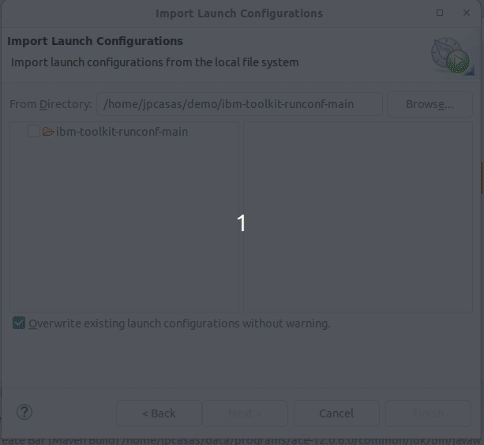
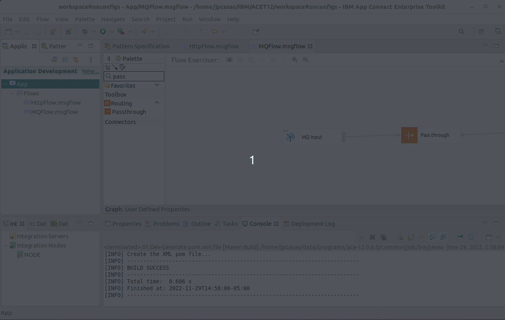
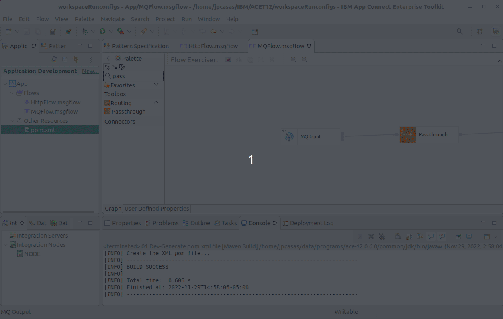
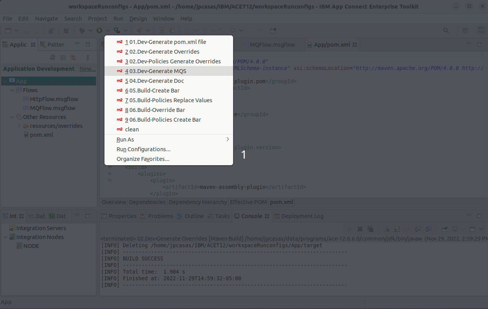
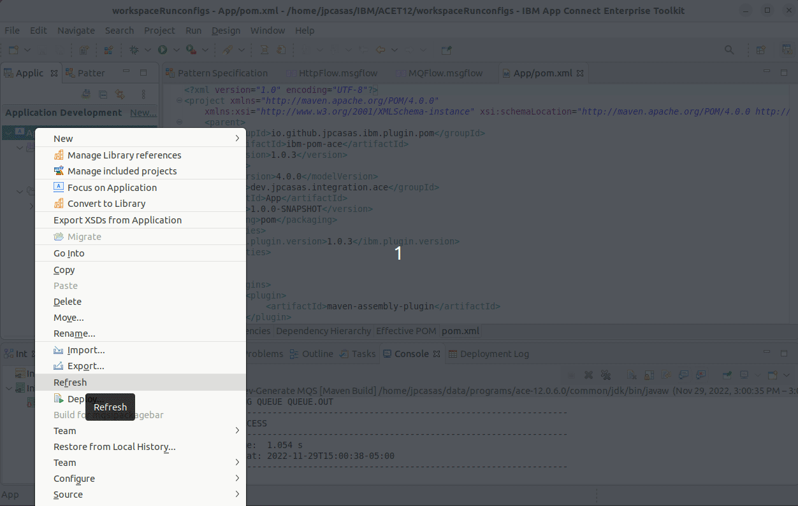
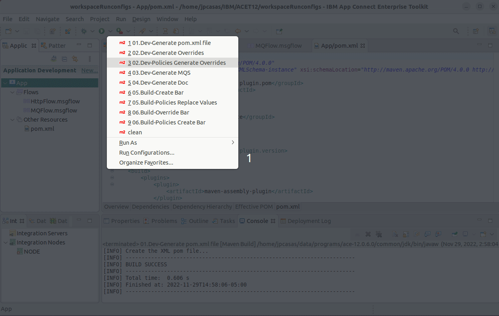
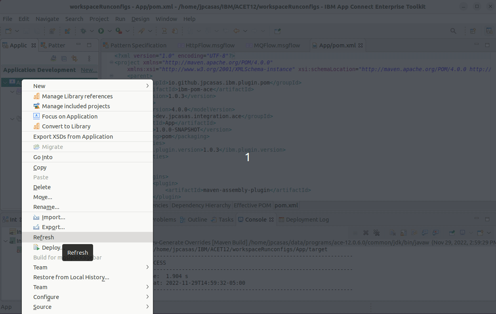
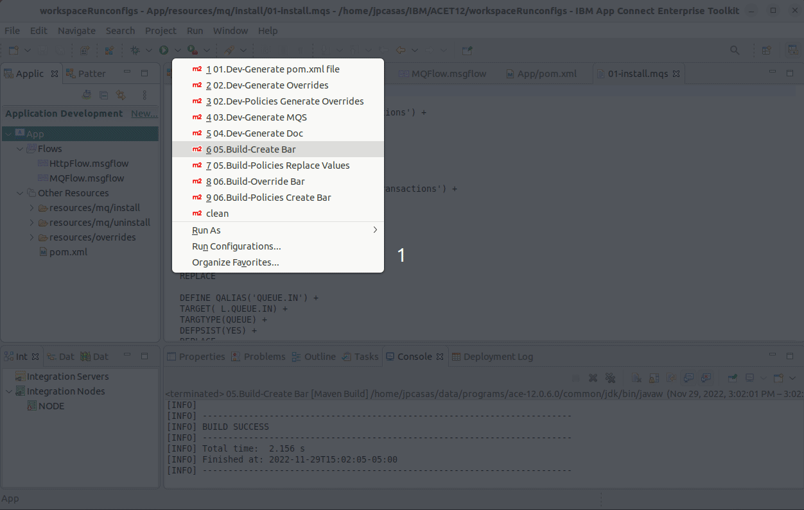
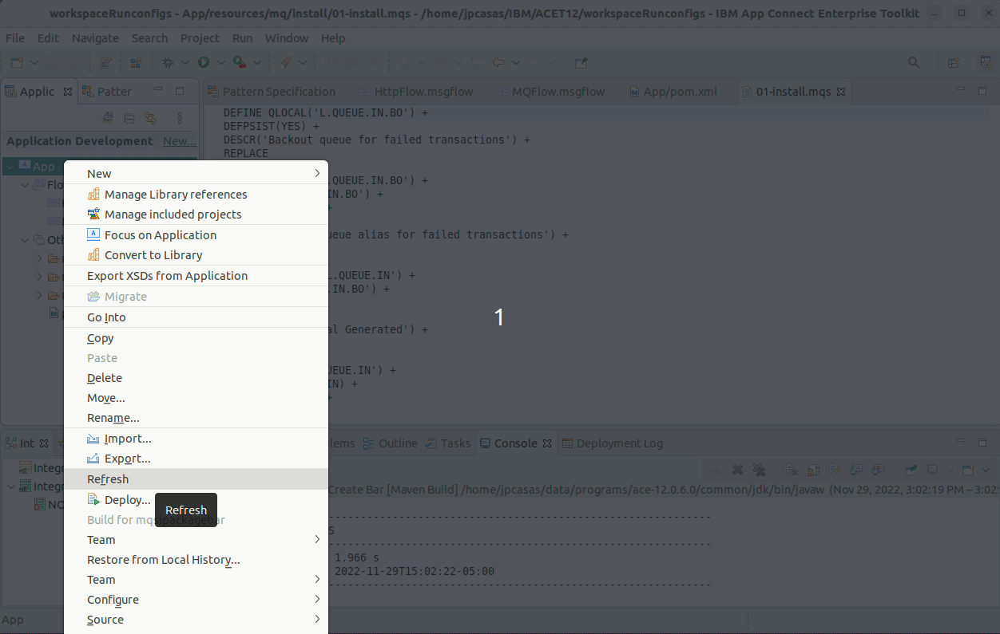

# Toolkit integration

1. Download launch configurations
   1. https://github.com/jpcasas/ibm-toolkit-runconf/archive/refs/heads/main.zip
2. Unzip into a local folder
3. Installation
   
   **Import configuration in Toolkit**
   
    
    

   **Filter launch configuration**
   
    

   **Select the unziped folder**

   **Add to favorites**

   **Mavenize**

   **Create MQ Script**

   **Create overrides**

   **Create barfile**

