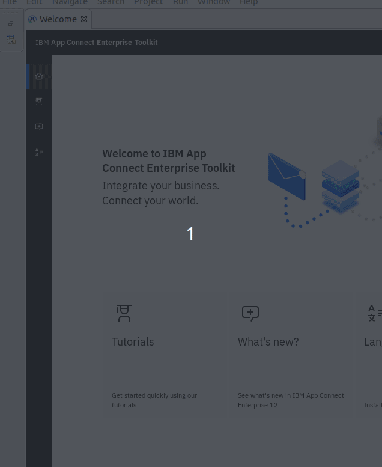
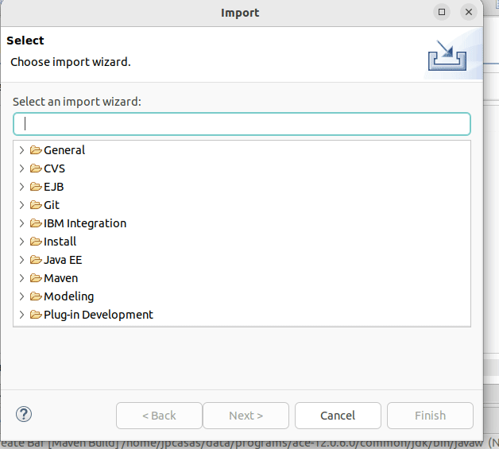

# Toolkit integration

1. Download launch configurations
   1. https://github.com/jpcasas/ibm-toolkit-runconf/archive/refs/heads/main.zip
2. Unzip into a local folder
3. Installation
   1. Import configuration in Toolkit
    
   2. Filter launch configuration
    
